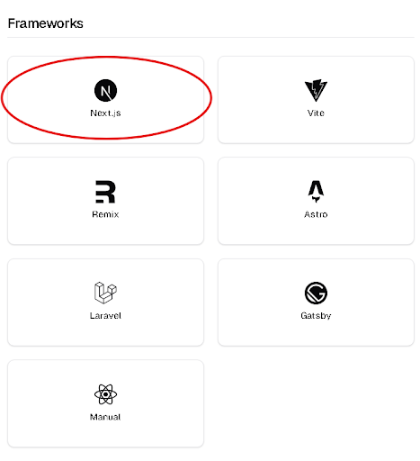
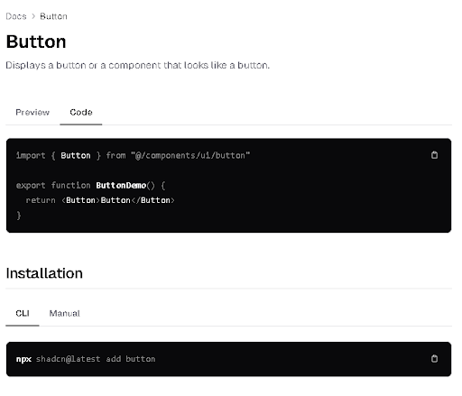

How to Start Development of a Web App Using a T3 Stack

1.First navigate to your desktop and right click an open space. 

2. Make a new folder on your computer named whatever you want your project to be named. I’ll be naming mine “test”.

3. Use any code editor such as Visual Studio Code or Cursor, I recommend using Visual Studio for beginners. Open the folder we just made with your code editor, then open the terminal. You can do this by either using CTRL+Shift+P and searching for terminal, or by using the shortcut which is `+P

4. Run the this command to download the files and create a t3 stack
npm create t3-app@latest(If you don’t have node.js you’ll need to install it here https://nodejs.org/en )

4.5 Only if you’re still having issues with installing node.js

If you’re still getting an error that the module is missing:
You need to Add C:\Program Files\nodejs to your PATH environment variable. To do this follow these steps:
Use the global Search Charm to search "Environment Variables"
Click "Edit system environment variables"
Click "Environment Variables" in the dialog.
In the "System Variables" box, search for Path and edit it to include C:\Program Files\nodejs. Make sure it is separated from any other paths by a ;.
You will have to restart any currently-opened command prompts before it will take effect.
After this go back and try step 4 again.

5. There are many different frameworks to use, for this tutorial we’ll use Next.js from https://ui.shadcn.com/docs/installation

To add shad/cn’s capabilities to our app we run
npx shadcn@latest init	(choose npm)
(You can use the -d flag for defaults i.e new-york, zinc and yes for the css variables.
ex: npx shadcn@latest init -d

You’ll then get a few options if you don’t want default options

6. After that you can use components from the shad/cn website by going to the component section from the website and copying the command into your terminal

7. To add these components you can import them with "import { Button } from "~/components/ui/button";" and then call it in your code!
   

8. Now you can edit files and run your app on your local host by running ‘npm run dev’ and in your terminal and then going to http://localhost:3000

I hope this tutorial was helpful for anyone trying to get into web development!

 

